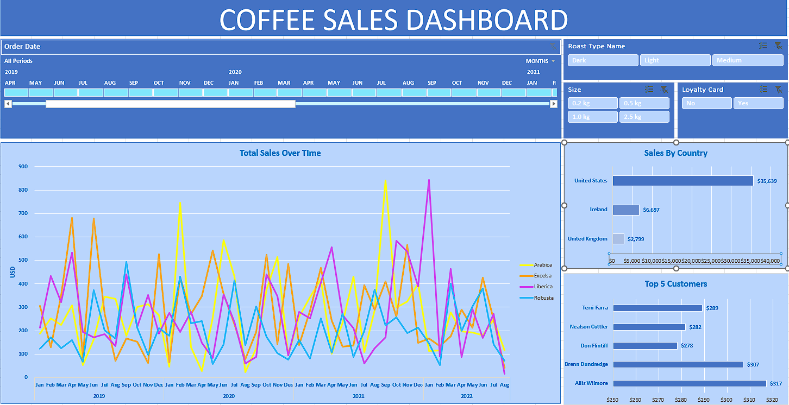
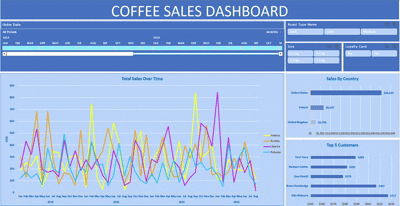

# Excel-Data-Project-Dashboard
Interactive Excel dashboard analyzing coffee sales using PivotTables, PivotCharts, formulas, and data visualization to uncover sales trends and product performance.
This project showcases an interactive Coffee Sales Dashboard built in Microsoft Excel using coffee sales data.

The goal of the project was to transform raw sales data into meaningful business insights through data cleaning, PivotTables, charts, and an interactive dashboard. The dashboard provides an easy-to-understand overview of sales performance and helps identify trends across different coffee products, locations, and time periods.

## Screenshot

## Demo

## Features
- **Total Sales Over Time** — multi-line trend chart broken out by coffee type (Arabica, Excelsa, Liberica, Robusta), 2019–2022
- **Sales by Country** — bar chart comparing revenue across United States, Ireland, and United Kingdom
- **Top 5 Customers** — bar chart ranking highest-spending customers
- **Interactive timeline slicer** — filter by Order Date with month/quarter zoom and scroll
- **Multi-select slicers** — Roast Type (Dark/Light/Medium), Size (0.2kg/0.5kg/1.0kg/2.5kg), and Loyalty Card (Yes/No), all cross-filtering the charts simultaneously
- **Relational data model** — built from three linked tables (Orders, Customers, Products)

## Data
- **Orders**: 1,000 records (date, customer, product, quantity, sales)
- **Customers**: contact and location details, loyalty card status
- **Products**: coffee type, roast type, size, unit price, profit per item

## Tools used
Excel — PivotTables, PivotCharts, Slicers, Timeline

## File
[coffeeOrdersData_mnguyen.xlsx] (coffeeOrdersData_mnguyen.xlsx)

## Downloadable file to use for your own practice:
[coffeeOrdersData.xlsx]
